<div  align="center">

<p align="center">
    
</p>
<h1 align="center">
    Morphe patches focused on Twitter/X <br>
    <a href ="https://t.me/pikopatches">
        
    </a>
</h1>

<summary><h2>🕹️ Usage</h2></summary>

<b>Morphe Cli</b>

```sh
java -jar cli.jar patch --patches piko.mpp input.apkm
```

<p><b>or Morphe Manager</b>
<details>

<div align="left">

<!-- TODO: Once enough time has passed, delete this sentence. -->
Starting with patches v3.0.0, Piko patches use [Morphe](https://morphe.software).

To use these patches in Morphe Manager, follow these steps:

#### Add Piko patches as a patch source 
1. Tap patch sources (lower left button)
2. Tap `+` button
3<!-- TODO: After first 3.0.0 stable is released, change this step to use https://github.com/crimera/piko
4Paste this repo url: `https://github.com/crimera/piko/blob/dev/patches-bundle.json`

#### Patching Twitter/X with Morphe
1. Download an original unpatched X APKM from a reputable source such as [APKMirror.com](https://www.apkmirror.com/apk/x-corp/twitter/)
2. Do _not_ unsplit or otherwise change the APKM. Morphe natively patches APKM/XAPK app bundles.
3. Select "Other apps" on the Morphe Manager home screen
4. Provide the original APKM file
5. Wait for patching to complete, install
</div>

</details>

<summary><h2>⚙️ Patch Details</h2></summary>
<details>
<table>
<thead>
<tr>
<th>Patch Name</th>
<th>Patch Description</th>
<th>Category</th>
<th>Image</th>
</tr>
</thead>

<tbody>

<tr>
<td><code>Remove Ads</code></td>
<td>Removes promoted posts in timeline and replies</td>
<td>Ads</td>
<td> <details>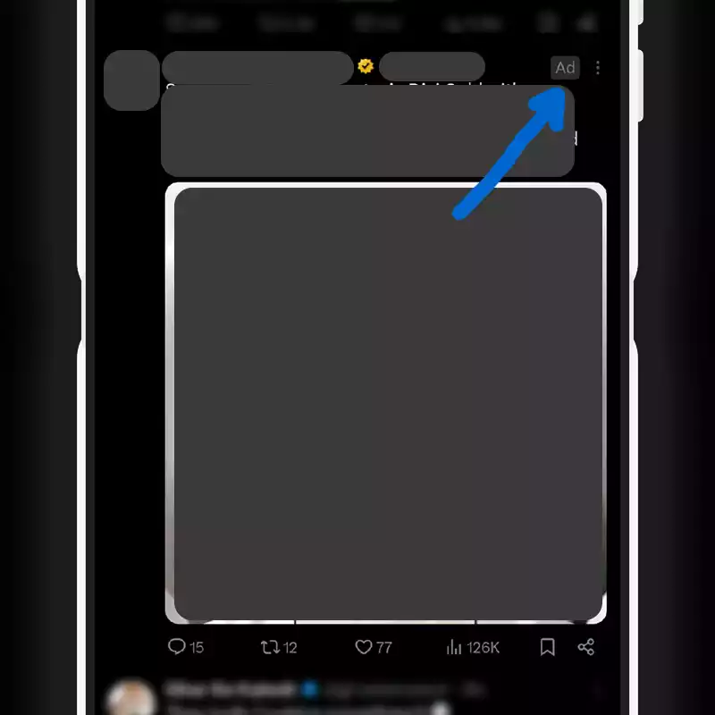</details></td>
</tr>

<tr>
<td><code>Remove Google Ads</code></td>
<td>Removes Google ads in timeline and replies</td>
<td>Ads</td>
<td> <details>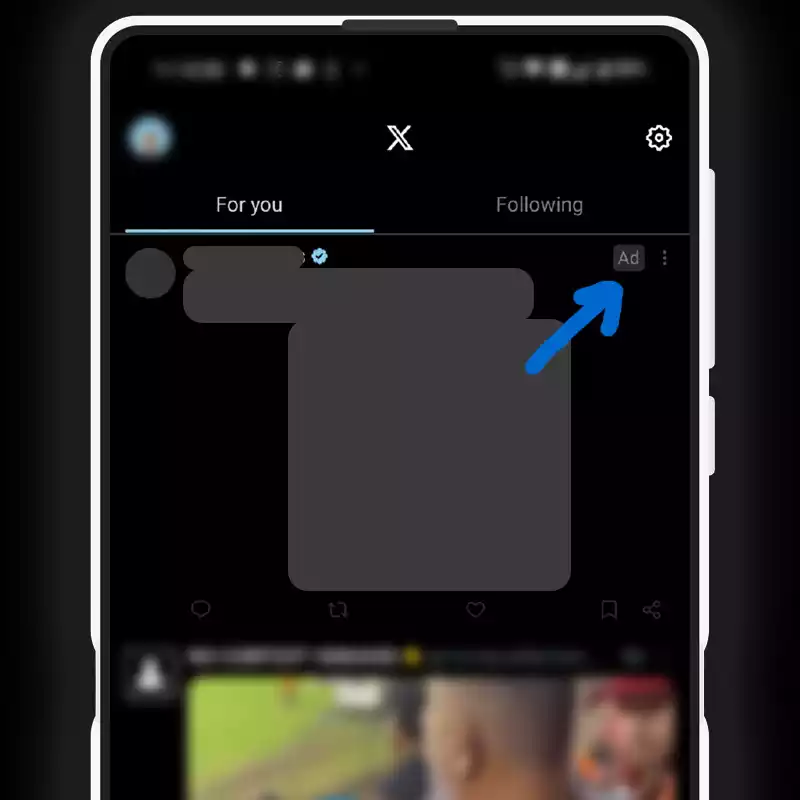</details></td>
</tr>

<tr>
<td><code>Remove "Who to follow" Banner</code></td>
<td>Removes "Who to follow" block in timeline</td>
<td>Ads</td>
<td> <details>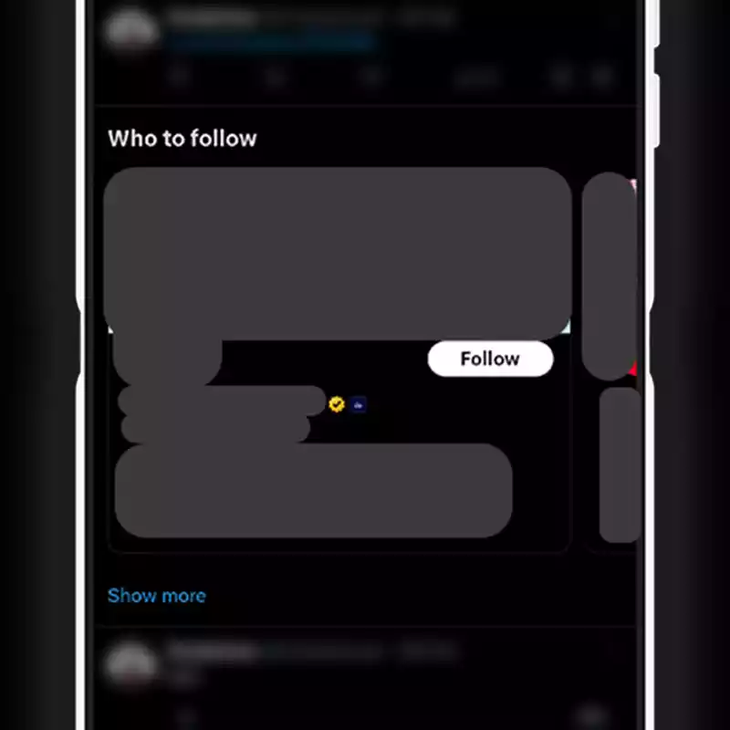</details></td>
</tr>

<tr>
<td><code>Remove "Communities to join" Banner</code></td>
<td>Removes "Communities to join" block in timeline</td>
<td>Ads</td>
<td> <details>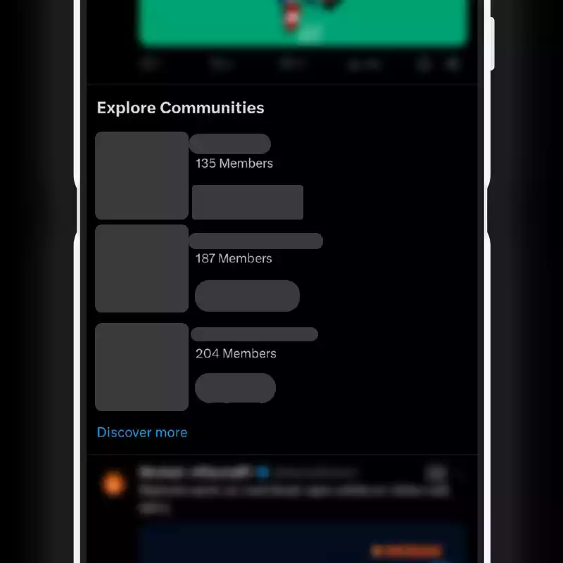</details></td>
</tr>

<tr>
<td><code>Remove "Creators to subscribe" Banner</code></td>
<td>Removes "Creators to subscribe" block in timeline</td>
<td>Ads</td>
<td> <details>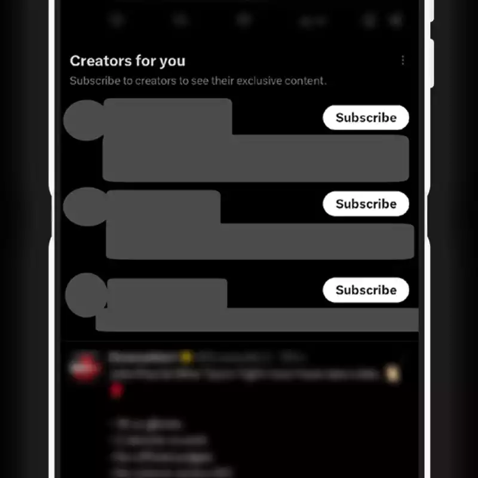</details></td>
</tr>

<tr>
<td><code>Remove "Pinned posts by followers" Banner</code></td>
<td>Removes "Pinned posts by followers" block in timeline</td>
<td>Ads</td>
<td> <details>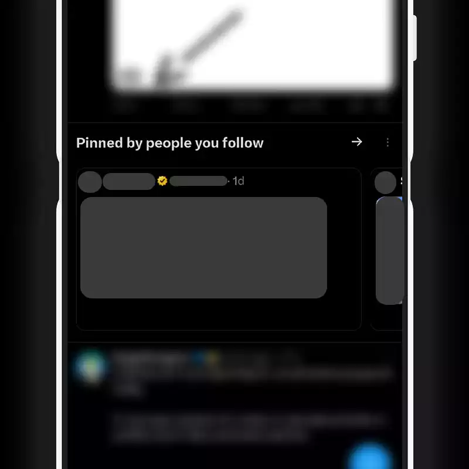</details></td>
</tr>

<tr>
<td><code>Remove "Revisit Bookmark" Banner</code></td>
<td>Removes "Revisit your bookmark" block in timeline</td>
<td>Ads</td>
<td> <details></details></td>
</tr>

<tr>
<td><code>Remove Detailed posts</code></td>
<td>Removes "Discover more" Banner in threads</td>
<td>Ads</td>
<td> <details>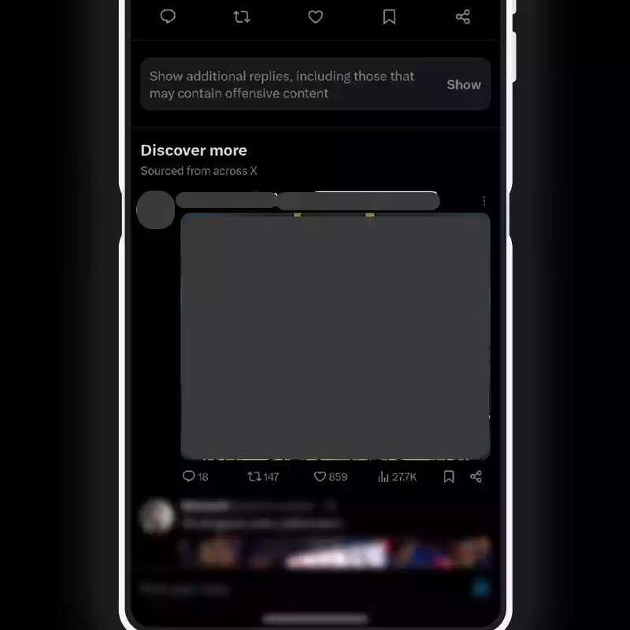</details></td>
</tr>

<tr>
<td><code>Hide Promoted Trends</code></td>
<td>Removes Hide Promoted Trends in explore</td>
<td>Ads</td>
<td> <details>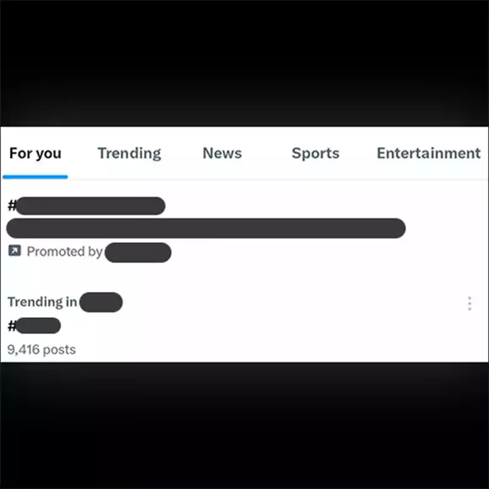</details></td>
</tr>

<tr>
<td><code>Custom download folder</code></td>
<td>Change the download directory for video downloads</td>
<td>Downloads</td>
<td></td>
</tr>

<tr>
<td><code>Clear tracking params</code></td>
<td>Removes tracking parameters when sharing links</td>
<td>Link</td>
<td></td>
</tr>

<tr>
<td><code>No shortened URL</code></td>
<td>Get rid of t.co short urls</td>
<td>Link</td>
<td></td>
</tr>

<tr>
<td><code>Bring back twitter</code></td>
<td>Bring back old twitter logo and name</td>
<td>Misc</td>
<td></td>
</tr>

<tr>
<td><code>Disable chirp font</code></td>
<td>Disable chirp font (X's default font)</td>
<td>Misc</td>
<td></td>
</tr>

<tr>
<td><code>Hide FAB</code></td>
<td>Hides Floating Action Button</td>
<td>Misc</td>
<td> <details>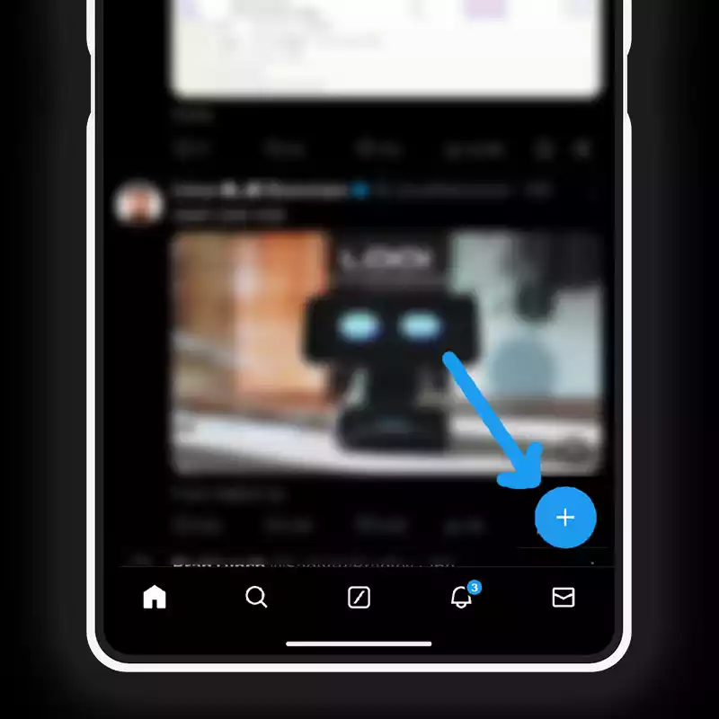</details></td>
</tr>

<tr>
<td><code>Hide FAB Menu Buttons</code></td>
<td>Hides Floating Action Button menu buttons</td>
<td>Misc</td>
<td> <details>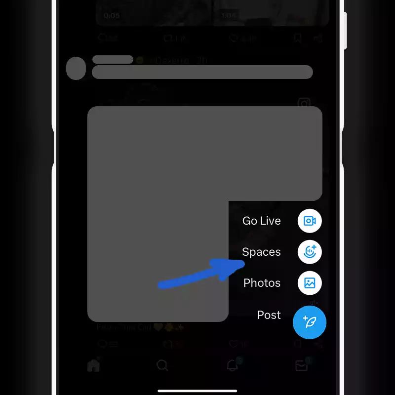</details></td>
</tr>

<tr>
<td><code>Hide Community Notes</code></td>
<td></td>
<td>Misc</td>
<td> <details>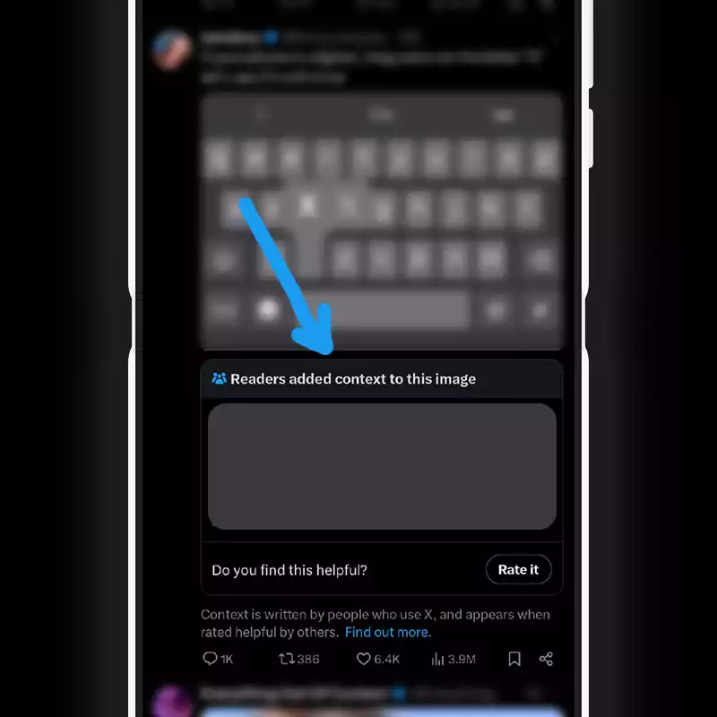</details></td>
</tr>

<tr>
<td><code>Hide Recommended Users</code></td>
<td>Hide recommended users that pops up when you follow someone</td>
<td>Misc</td>
<td> <details>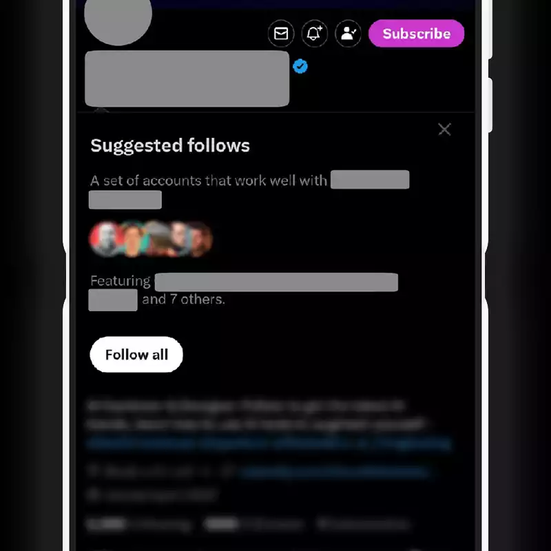</details></td>
</tr>

<tr>
<td><code>Selectable Text</code></td>
<td>Makes bio and username selectable</td>
<td>Misc</td>
<td> <details>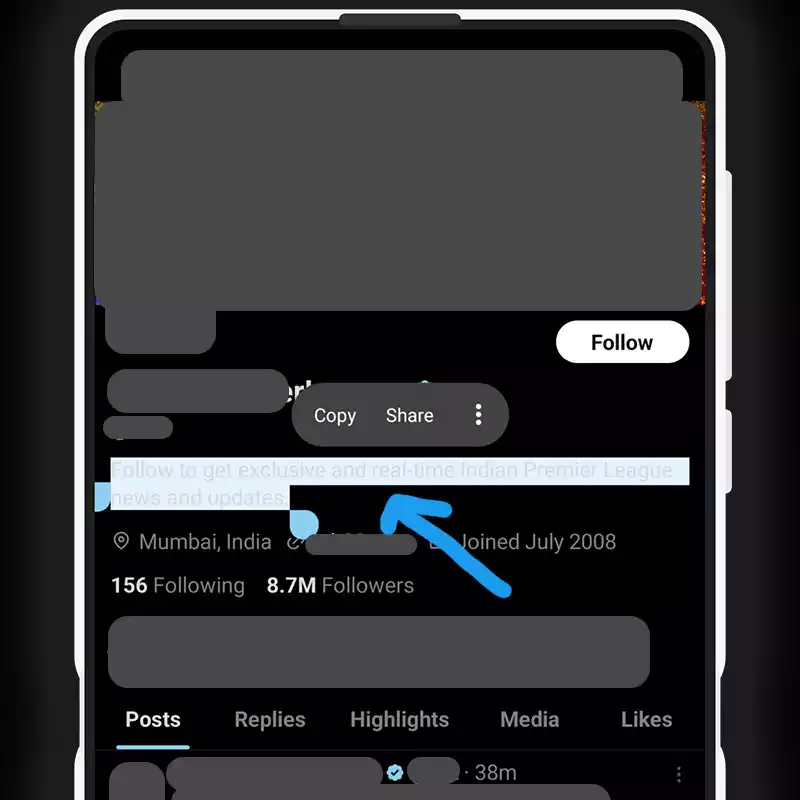</details></td>
</tr>

<tr>
<td><code>Show sensitive media</code></td>
<td></td>
<td>Misc</td>
<td> <details>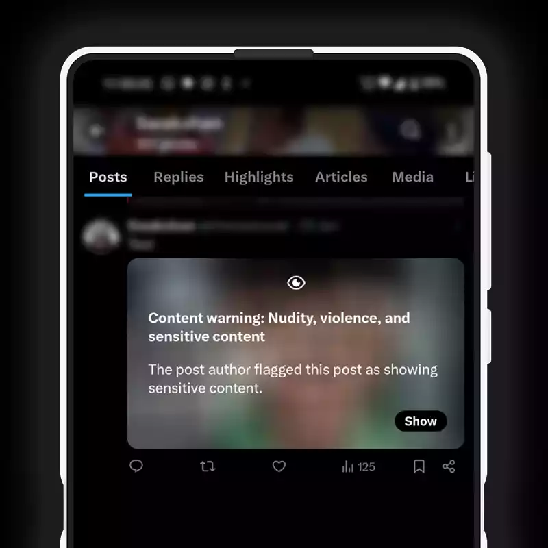</details></td>
</tr>

<tr>
<td><code>Adds settings</code></td>
<td>Adds mod settings</td>
<td>Misc</td>
<td> <details>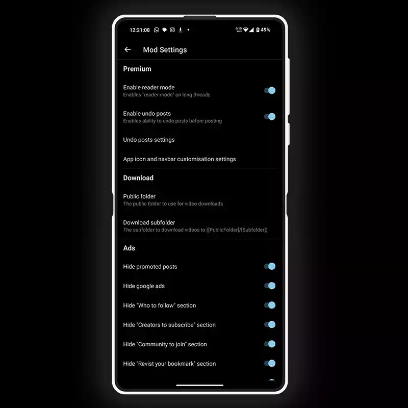</details></td>
</tr>

<tr>
<td><code>Remove view count</code></td>
<td>Removes the view count from the bottom of tweets</td>
<td>Misc</td>
<td> <details></details></td>
</tr>

<tr>
<td><code>Hook feature flag</code></td>
<td>Allows for adding custom feature flags</td>
<td>Misc</td>
<td></td>
</tr>

<tr>
<td><code>Enable custom app icon and nav icon settings</code></td>
<td></td>
<td>Premium</td>
<td> <details>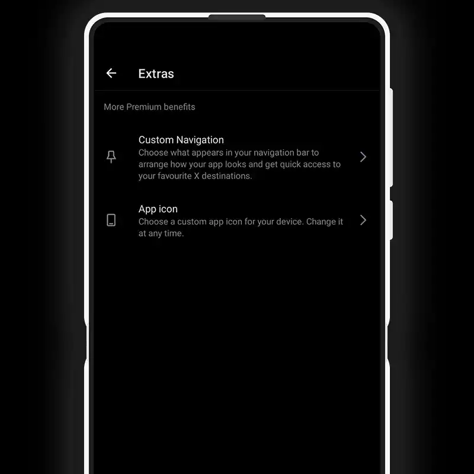</details></td>
</tr>

<tr>
<td><code>Enable Reader Mode</code></td>
<td>Enables \"Reader Mode\" on long threads. Requires X 10.72.2-release.0 or earlier.</td>
<td>Premium</td>
<td> <details>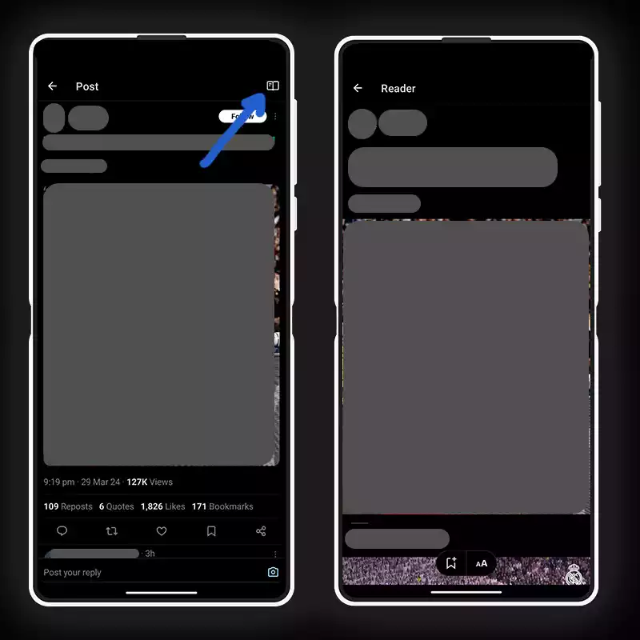</details></td>
</tr>

<tr>
<td><code>Enable Undo Posts</code></td>
<td>Enables ability to undo posts before posting</td>
<td>Premium</td>
<td> <details>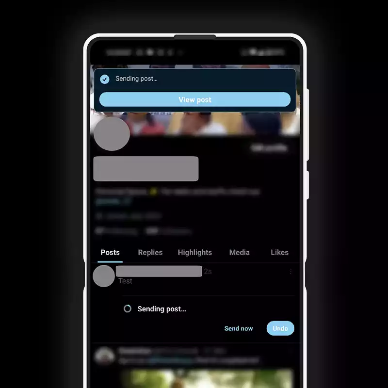</details></td>
</tr>

<tr>
<td><code>Download patch</code></td>
<td>Unlocks the ability to download videos and gifs</td>
<td>Premium</td>
<td> <details>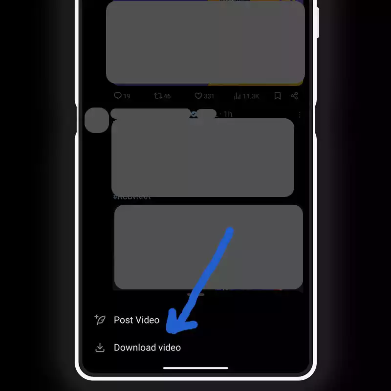</details></td>
</tr>

<tr>
<td><code>Hide Banner</code></td>
<td>Hide new post banner</td>
<td>Timeline</td>
<td> <details>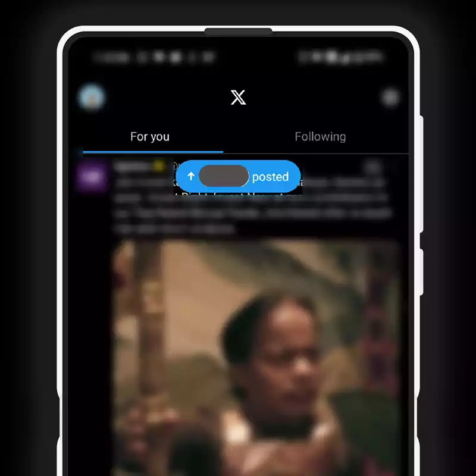</details></td>
</tr>

<tr>
<td><code>Hide For You</code></td>
<td>Hides For You tab from timeline</td>
<td>Timeline</td>
<td> <details>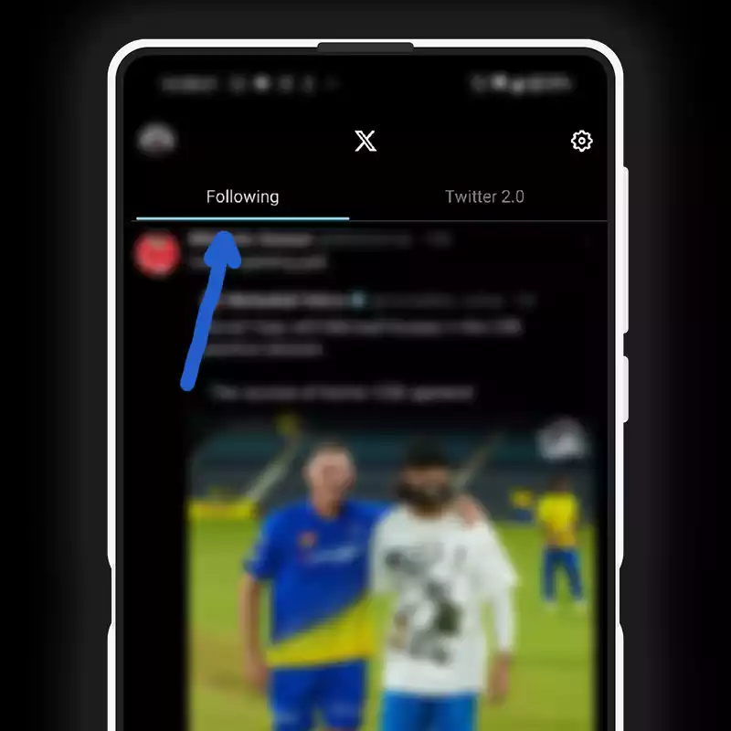</details></td>
</tr>

<tr>
<td><code>Hide Live Threads</code></td>
<td>Hide Live section</td>
<td>Timeline</td>
<td> <details>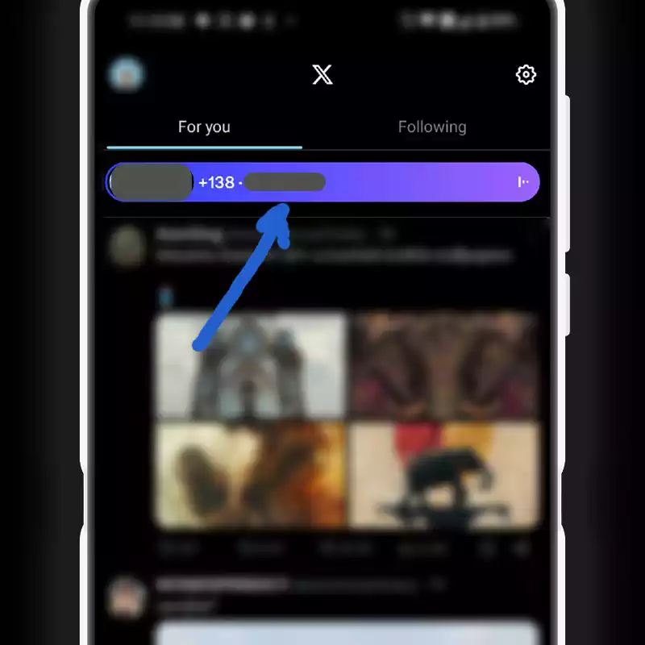</details></td>
</tr>

<tr>
<td><code>Hide bookmark icon in timeline</code></td>
<td></td>
<td>Timeline</td>
<td></td>
</tr>

</tbody>
</table>
</details>


<summary><h2>🛠️ Building</h2></summary>
To build Piko Patches, you can follow the <a href="https://github.com/MorpheApp/morphe-documentation">Morphe documentation</a>.


<summary><h2>✨Stargazers over time</h2></summary>
<p align="center">
    
</p>

</div>

## License
[](http://www.gnu.org/licenses/gpl-3.0.en.html)

These patches are fully FOSS. You can use, study, share and modify it at your will. They can be redistributed and/or modified under the terms of the [GNU General Public License](https://www.gnu.org/licenses/gpl.html) version 3 or later published by the Free Software Foundation.

---
